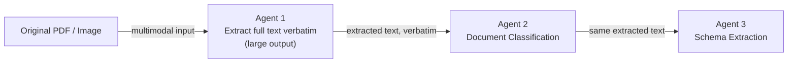
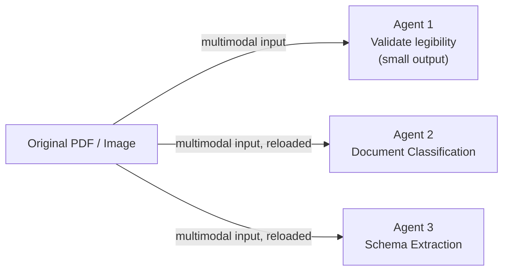

# Gemini Document-Processing Architecture Benchmark — Explainer

This document explains what the benchmark harness in this repo does, the two
architectures it compares, and how to read the results it produces —
including a cost projection using published Gemini 2.5 Pro pricing.

## The question being answered

When a pipeline runs several agents over the same document, there are two
natural ways to give each agent access to the document's content:

1. **Extract the text once, and pass that text to every downstream agent.**
2. **Give every agent the raw document and let it reprocess it independently.**

These have very different cost profiles once documents are large or the
number of agents grows, but the difference is easy to hand-wave about and
hard to actually quantify without measuring it. This harness measures it:
same documents, same model, equivalent prompts, only the architecture
differs.

## Executive Summary

For a workload of **2,500 applications per month**, with **5 documents per
application** and approximately **700 text tokens per document**, the monthly
volume is 12,500 documents. Using the measured sample averages and the Gemini
2.5 Pro rates above ($1.25 per 1M input tokens and $10 per 1M output tokens):

| Metric | Approach A (extract once) | Approach B (reprocess) | Difference |
|---|---:|---:|---:|
| Estimated cost per document | $0.011238 | $0.005480 | B saves $0.005758 |
| Estimated cost per application | **$0.0562** | **$0.0274** | **B saves $0.0288** |
| Estimated monthly cost | **$140.47** | **$68.50** | **B saves $71.97** |
| Sequential agent latency per document | **6.84s** | **13.37s** | **A is 6.52s faster** |

At this larger document-text size, Approach B is estimated to cost about 51.2%
less than Approach A, even though it takes about 95.4% longer per document once
artifact-store loading is included. The cost reversal happens because Approach
A must emit the full 700-token transcription, and output tokens cost much more
than input tokens. Approach A uses fewer input tokens and is faster in the
measured sequential benchmark; Approach B avoids the large transcription
output but resends each document to all three agents.

The cost estimate assumes one extraction, one classification, and one schema
extraction call per document, with the sample's measured output sizes for the
downstream agents. The latency estimate applies the measured mean per-document
latencies to one document and adds **3 seconds for every raw-document load from
the artifact store**. Approach A loads each document once, adding 3 seconds per
document. Approach B loads each document for all three agents, adding 9 seconds
per document. The agents are assumed to run sequentially, not in parallel,
while the five documents within one application can be processed in parallel.
Therefore, the application wall-clock latency can be approximately the
per-document latency when all five document jobs run concurrently, although
total compute and API usage still scale with five documents. This does not
model any additional latency caused by a 700-token transcription, so a
production rerun with representative documents should be used for final
latency planning.

## Approach A — "Extract once"

- The original document is loaded and sent to Gemini **once**, to Agent 1.
- Agent 1's job here is specifically to transcribe the document: extract all
  readable text verbatim. That's a necessarily large-output task, because
  the whole point is to produce the text every downstream agent will use.
- Agent 1's raw text output is stored and reused **verbatim** — no
  re-extraction, no editing, no summarizing it further.
- Every downstream agent (2, 3, ...) receives that stored text as plain text
  input and asks its own narrow question of it (classify it / pull specific
  fields as JSON); it never sees the original file again.
- Only Agent 1's Gemini call is multimodal (document bytes + prompt);
  Agents 2..N are text-only calls.

**Cost shape**: document-processing cost (loading + the large multimodal
input) is paid exactly once per document, no matter how many agents run
afterward. The one unavoidable expense is Agent 1's large *output* (the
transcription itself), which then becomes cheap, reusable input for
everyone downstream. Downstream agents pay only for that extracted text as
input plus their own small JSON/classification output.

## Approach B — "Reprocess"

- Every agent independently loads the original document from disk and sends
  it to Gemini as multimodal input.
- Agents are fully independent — none of them depend on another agent's
  output, and there is no shared extracted-text state at all.
- Crucially, **Agent 1's job is different here too**: since nothing
  downstream consumes its output, it has no reason to transcribe the whole
  document. It asks its own narrow question instead — "is this document
  legible?" — and returns a small 2-field JSON verdict, exactly like Agents
  2 and 3 ask their own narrow questions ("what category is this?" /
  "what are these specific field values?"). All three agents' prompts avoid
  asking for free-text explanations (no "justification", no "notes") so
  their output size reflects the answer itself, not incidental prose.
- The document is loaded from disk **N times** (once per agent), and that
  repeated load cost is deliberately measured, not hidden — see
  `load_document()` in the harness.

**Cost shape**: every agent pays for the large multimodal *input* (the
document bytes), but every agent's *output* stays small, since each one is
answering a targeted yes/no-or-JSON question rather than transcribing
anything. Input cost scales with agent count; output cost does not.

## What's held constant between A and B, and what's deliberately not

So the comparison isolates architecture, not incidental differences:

- Same documents, same Gemini model, same number of agents, same run count.
- **Agents 2..N use an identical `prompt`** in both approaches — the harness
  supplies either the raw document or the extracted text alongside it, so
  the instruction itself is equivalent; each one asks the same targeted
  question regardless of which approach it's running under.
- **Agent 1 is intentionally *not* given identical prompts.** Its job is
  structurally different between the two architectures: in Approach A it
  must produce reusable full text (so it needs a verbose, transcription-style
  prompt); in Approach B nothing consumes its output, so forcing it to
  transcribe the whole document would just inflate its output tokens for no
  reason. Its Approach B prompt matches the "narrow independent question"
  pattern every other agent already uses. This is configured via
  `agents_config.json`'s `approach_a_prompt` field on Agent 1 (see README).
- Agents are deliberately simple/dummy (extraction/validation,
  classification, schema extraction) so what's being measured is the
  architecture's latency/token cost, not the quality of any real business
  logic.
- Approaches are never interleaved: all of Approach A runs first (across
  every document and run), then all of Approach B.

## What gets measured, per Gemini call

`document_name, approach, agent_name, agent_number, run_index, start_time,
end_time, latency_seconds, document_load_seconds, gemini_api_latency_seconds,
total_agent_latency_seconds, input_token_count, output_token_count,
total_token_count, model_name, success, error_message`

— written to `output/gemini_calls_<timestamp>.csv`, one row per call. A
second CSV, `output/document_summary_<timestamp>.csv`, aggregates this to
one row per (document, approach, run): total latency, total tokens, call
count, failure count. A final console report compares Approach A vs B on
mean/P50/P95 latency and mean/total tokens, plus percentage differences.

## Repo layout

| File | Purpose |
|---|---|
| `gemini_architecture_benchmark.py` | The harness itself |
| `agents_config.json` | Agent names/prompts (editable, no code changes needed) |
| `dc_data/` | Sample input documents |
| `test_gemini_api.ipynb` | Minimal notebook to sanity-check API key/model before a full run |
| `output/` | Generated CSVs (gitignored) |
| `pricing_config.json` | Optional token pricing for cost estimates (see below) |

## Results so far (sample run, 2 documents, 3 agents, 1 run each)

Measured on `gemini-3.5-flash-lite` (see "A note on model access" in
`README.md` — this key doesn't currently have `gemini-2.5-pro` access, so
this run substitutes a free-tier model; the *architectural* difference in
latency/tokens still holds regardless of which model is underneath, since
both approaches use the same model in the same run):

| Metric | Approach A (extract once) | Approach B (reprocess) | B vs A |
|---|---:|---:|---:|
| Gemini calls | 6 | 6 | — |
| Avg latency (s) | 1.281 | 1.456 | +13.7% |
| P50 latency (s) | 1.128 | 1.553 | +37.7% |
| P95 latency (s) | 1.989 | 1.820 | -8.5% |
| Avg input tokens | 534.3 | 1138.7 | +113.1% |
| Avg output tokens | 94.2 | 40.3 | **-57.2%** |
| Total tokens | 3,771 | 7,074 | +87.6% |

Two distinct effects are visible here, matching the two architectures'
actual token shapes:

- **Input tokens are much higher for B** (+113.1%) — this is the direct
  cost of resending the full document to every agent instead of just once.
- **Output tokens are much *lower* for B** (-57.2%) — because B's Agent 1
  only returns a small 2-field legibility verdict instead of transcribing
  the whole document, while A's Agent 1 must produce that full
  transcription. Looking at individual calls on the same documents:
  - `document_extraction`: A outputs 168-184 tokens (full transcription) vs.
    B's 24 tokens (small JSON verdict) — the one agent whose job genuinely
    differs between approaches.
  - `document_classification`: **1 output token in both approaches** —
    identical prompt, identical minimal answer, exactly as it should be.
  - `schema_extraction`: ~94-110 tokens in both approaches — also
    identical, since extracting several real field values inherently takes
    more than one token regardless of architecture.

Input tokens dominate the total either way, so B still costs more overall,
but by a much smaller, more honest margin than when Agent 1's prompt was
accidentally shared across both approaches.

### Step-by-step walkthrough: one document through both approaches

Full per-agent trace for `dc1.png`, straight from that run's
`gemini_calls_20260916_233702.csv` (model: `gemini-3.5-flash-lite`; cost
column uses the Gemini 2.5 Pro rates from the section below: $1.25/1M
input, $10/1M output).

**Approach A — extract once**

| Step | Agent | What it does | Its input | Input tokens | Latency | Output tokens | Cost |
|---|---|---|---|---:|---:|---:|---:|
| 1 | `document_extraction` | Calls Gemini with the original image, extracts all text verbatim | the raw `dc1.png` file | 1,132 | 2.104s | 184 | $0.003255 |
| 2 | `document_classification` | Calls Gemini with a classification question | Agent 1's extracted text, verbatim | 234 | 0.727s | 1 | $0.000303 |
| 3 | `schema_extraction` | Calls Gemini asking for 6 specific fields as JSON | Agent 1's extracted text, verbatim | 247 | 1.178s | 110 | $0.001409 |
| **Total** | | | | **1,613** | **4.009s** | **295** | **$0.004967** |

Note the data flow: Agents 2 and 3 both receive **Agent 1's output directly**
— they don't chain off each other. Agent 3 doesn't see Agent 2's
classification result; both just independently ask their own question of
the same stored text. Only Agent 1 ever touches the original image.

**Approach B — reprocess**

| Step | Agent | What it does | Its input | Input tokens | Latency | Output tokens | Cost |
|---|---|---|---|---:|---:|---:|---:|
| 1 | `document_extraction` | Calls Gemini with the original image, checks legibility only | the raw `dc1.png` file (reloaded from disk) | 1,149 | 1.750s | 24 | $0.001676 |
| 2 | `document_classification` | Calls Gemini with a classification question | the raw `dc1.png` file (reloaded from disk again) | 1,118 | 1.610s | 1 | $0.001408 |
| 3 | `schema_extraction` | Calls Gemini asking for 6 specific fields as JSON | the raw `dc1.png` file (reloaded from disk again) | 1,131 | 1.843s | 98 | $0.002394 |
| **Total** | | | | **3,398** | **5.205s** | **123** | **$0.005477** |

Here every agent independently reloads and resends the same file — that's
the entire +1,785 input-token, +$0.00051, +1.196s difference between the
two totals on this one document. (Latency totals are the sum of each
agent's own call; if the three agents ran concurrently instead of
sequentially, wall-clock time would be closer to the single slowest agent
rather than the sum — but this harness runs agents sequentially by design,
matching how the goal specifies both architectures should operate.)

### Input tokens: raw document vs. extracted text, per call

This is the direct answer to "how much cheaper is text-only input than
resending the document": every per-agent input token count from that same
run, `gemini_calls_20260916_233702.csv`, agent by agent:

| Document | Agent | Approach A input tokens | Approach B input tokens |
|---|---|---:|---:|
| dc1.png | document_extraction (multimodal in both) | 1,132 | 1,149 |
| dc1.png | document_classification | **234** (text-only) | 1,118 (multimodal, reloaded) |
| dc1.png | schema_extraction | **247** (text-only) | 1,131 (multimodal, reloaded) |
| dc2.png | document_extraction (multimodal in both) | 1,144 | 1,161 |
| dc2.png | document_classification | **218** (text-only) | 1,130 (multimodal, reloaded) |
| dc2.png | schema_extraction | **231** (text-only) | 1,143 (multimodal, reloaded) |

Agent 1 is multimodal in both approaches (~1,130-1,160 input tokens either
way — the two prompts are different lengths, hence the small A/B gap on
that row alone). The comparison that matters is everything *after* Agent 1:

| | Avg input tokens/call | 
|---|---:|
| Raw document, resent (Approach B, agents 2 & 3) | 1,130.5 |
| Extracted text only (Approach A, agents 2 & 3) | 232.5 |

**Extracted-text input is 79.7% smaller — about 4.9x fewer tokens per
downstream call** than resending the raw document. That gap is the entire
mechanism behind Approach A's lower cost: it only pays the ~1,130-token
"send the document" price once (Agent 1), while Approach B pays it again,
in full, for every single agent.

Rolled up to per-document totals (sum of input tokens across all 3 agents):

| Document | Approach A total input | Approach B total input | B vs A |
|---|---:|---:|---:|
| dc1.png | 1,613 | 3,398 | +110.7% |
| dc2.png | 1,593 | 3,434 | +115.6% |

With 3 agents, Approach B's downstream agents (2 of the 3) each pay the
full ~1,130-token document price instead of the ~230-token text price —
that's where essentially all of the +113% average-input-token gap reported
above comes from.

## Cost projection using Gemini 2.5 Pro pricing

The harness doesn't assume any token price by default (see `README.md`
"Pricing"), but since the goal specifically targets `gemini-2.5-pro`, here's
what the measured token counts above would cost at Google's **published**
2.5 Pro rates (paid tier, prompts ≤200k tokens, current as of Sep 2026):

- **Input**: $1.25 per 1M tokens
- **Output**: $10.00 per 1M tokens

Source: [Gemini Developer API pricing — ai.google.dev](https://ai.google.dev/gemini-api/docs/pricing)

Applying those rates to the actual token totals from the sample run above:

| | Approach A | Approach B | Difference |
|---|---:|---:|---:|
| Total input tokens | 3,206 | 6,832 | +113.1% |
| Total output tokens | 565 | 242 | -57.2% |
| **Cost for these 2 documents** | **$0.009658** | **$0.010960** | **+13.5%** |
| Extrapolated to 1,000 documents | **≈ $4.83** | **≈ $5.48** | **+$0.65** |

Caveat: these token *counts* came from `gemini-3.5-flash-lite`'s tokenizer,
not `gemini-2.5-pro`'s — actual 2.5 Pro token counts for the same documents
would likely differ somewhat (different tokenizer/vision encoding), so
treat this as an order-of-magnitude illustration, not an exact quote. The
qualitative shape — B's input cost dominates and pushes its total above A,
even though B's output cost is actually lower — follows directly from each
architecture's structure and would hold on 2.5 Pro too.

To get a live cost estimate on your own runs at whatever rates you choose,
copy `pricing_config.example.json` to `pricing_config.json` (already done
here, pre-filled with the 2.5 Pro rates above) and pass
`--pricing-config pricing_config.json` — the harness adds an
"Est. cost (USD)" row to its final report automatically.

## Takeaway

On the small sample run, Approach A (extract once) was cheaper overall and
had lower P50/mean latency, but the reason is more specific than "B repeats
more work": B's *input* cost scales with agent count (every agent re-pays for
the full document), while B's *output* cost is much lower than A's, since only
A's Agent 1 has to transcribe anything. With 700-token documents, the higher
output-token cost reverses the cost result: the projection above makes B
cheaper, while A remains faster in the measured sequential pattern. Approach
B's structural advantage is that agents are fully independent — no
extraction-quality bottleneck where one bad Agent-1 call breaks everyone
downstream. The right choice depends on document size, output-token pricing,
latency requirements, and whether that independence is worth the repeated
multimodal input.
