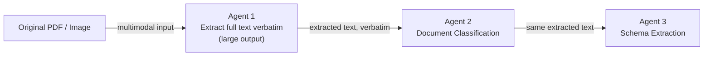
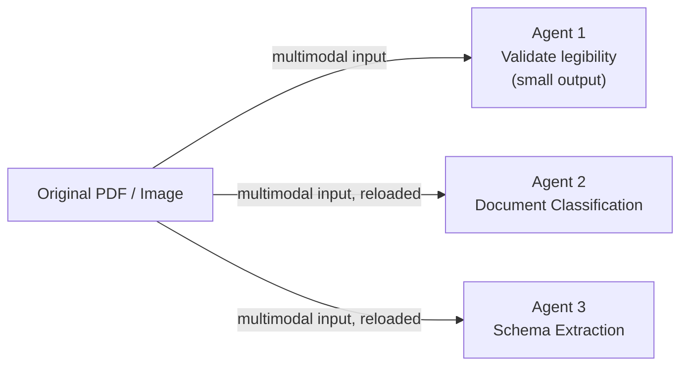
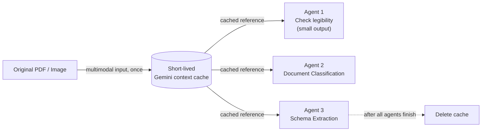

# Gemini Document-Processing Architecture Benchmark — Explainer

This document explains what the benchmark harness in this repo does, the
three architectures it compares, and how to read the results — including a
cost estimate using published Gemini 3.1 Pro Preview pricing.

## The question being answered

When a pipeline runs several agents over the same document, there are a few
straightforward ways to give each agent access to the document:

1. **Extract the text once, then pass it to every downstream agent.**
2. **Give every agent the raw document and let it reprocess it independently.**
3. **Cache the raw document once, then let every agent query that cache
   independently.**

These choices can have very different cost profiles as documents get longer or
more agents are added. The harness measures the difference using the same
documents, model, and questions, changing only the architecture.

## Executive Summary

### Assumptions

| Item | Value |
|---|---:|
| Applications per month | 2,500 |
| Documents per application | 5 |
| Total documents per month | 12,500 |
| PDF pages per document | 5 |
| PDF tokens per page | 258 |
| Raw PDF tokens per document | 1,290 |
| Extracted text per document | 700 |
| Gemini 3.1 Pro Preview input price | $2 / 1M tokens |
| Gemini 3.1 Pro Preview output price | $12 / 1M tokens |
| Gemini 3.1 Pro Preview cache-storage price | $4.50 / 1M tokens-hour |
| Approach C cache lifetime | 1 minute |
| Approach C cached PDF tokens per document | 1,290 |

### Approach A — Extract once

| Calculation | Result |
|---|---:|
| Input per document | 1,290 PDF + 700 text + 700 text = **2,690** |
| Output per document | **800** |
| Monthly input tokens | 2,690 x 12,500 = **33.625M** |
| Monthly output tokens | 800 x 12,500 = **10.00M** |
| Monthly input cost | 33.625M x $2 = **$67.25** |
| Monthly output cost | 10.00M x $12 = **$120.00** |
| **Total monthly cost** | **$187.25** |

### Approach B — Reprocess

| Calculation | Result |
|---|---:|
| Input per document | 1,290 PDF x 3 agents = **3,870** |
| Output per document | **100** |
| Monthly input tokens | 3,870 x 12,500 = **48.375M** |
| Monthly output tokens | 100 x 12,500 = **1.25M** |
| Monthly input cost | 48.375M x $2 = **$96.75** |
| Monthly output cost | 1.25M x $12 = **$15.00** |
| **Total monthly cost** | **$111.75** |

### Approach C — Cache once, query many

Approach C's three agents are structurally identical to Approach B's: Agent 1
returns the same small legibility verdict (not a transcript), and Agents 2/3
ask the same questions. The only architectural difference is *how* the
document reaches each agent — through a shared cache instead of three
independent uploads.

Per the instructions for this projection, the LLM-call cost below
deliberately assumes **no** input-token discount from caching — see the
caveat at the end of this section for why. With that assumption, Approach C's
LLM-call cost is identical to Approach B's; cache storage is added as a
separate line:

| Calculation | Result |
|---|---:|
| Input per document (unchanged from B — no cache discount assumed) | 1,290 PDF x 3 agents = **3,870** |
| Output per document (unchanged from B) | **100** |
| Monthly input tokens | 3,870 x 12,500 = **48.375M** |
| Monthly output tokens | 100 x 12,500 = **1.25M** |
| Monthly LLM input cost | 48.375M x $2 = **$96.75** |
| Monthly LLM output cost | 1.25M x $12 = **$15.00** |
| **Subtotal, LLM calls** | **$111.75** |
| Cached tokens per document | **1,290** |
| Cache lifetime | **1 minute** (1/60 hour) |
| Cached token-hours/month | 1,290 x 12,500 x (1/60) = **268,750** |
| **Cache storage cost** | 268,750 / 1M x $4.50 = **$1.21** |
| **Total monthly cost** | **$111.75 + $1.21 = $112.96** |

**Caveat — this deliberately does not assume caching saves money.** The whole
point of a cache is that Agents 2 and 3 shouldn't need to re-pay for the
document, but this harness never assumes that: it only reports a discount if
`cached_content_token_count` in the API's own `usage_metadata` confirms it
(see `run_approach_c()` and the "Confirmed cache-hit calls" row in the
benchmark's printed report). Absent that confirmation, this projection treats
Approach C's LLM-call cost as **identical to Approach B's**, with cache
storage shown as pure additional overhead — so, on paper, Approach C
currently looks marginally *more* expensive than B, not less. If a live run
confirms cache hits, Approach C's real input cost — and therefore its total —
would drop below what's shown here; that must come from measurement, not this
spreadsheet.

### Final comparison

| | Approach A | Approach B | Approach C |
|---|---:|---:|---:|
| Input tokens per document | 2,690 | 3,870 | 3,870 (no discount assumed) |
| Output tokens per document | 800 | 100 | 100 |
| **Monthly LLM cost** | **$187.25** | **$111.75** | **$111.75** |
| **Monthly cache storage cost** | — | — | **$1.21** |
| **Total monthly cost** | **$187.25** | **$111.75** | **$112.96** |
| Sequential latency per document | **6.84s** | **13.37s** | *not modeled — see note* |

The main idea for A vs. B is simple: Approach A saves input tokens by reusing
the extracted text, but it produces a much larger output. Approach B spends
more on input tokens, but it avoids the 700-token transcript. These figures
use the official Gemini 3.1 Pro Preview rates; exact PDF usage should be
confirmed with `count_tokens()` and response `usage_metadata`.

Approach C's row is left out of the latency line deliberately: the 6.84s/
13.37s figures in this table predate this document's available history (see
the removed `goal.txt`) and their derivation — beyond "sum of per-call
latency" — isn't preserved anywhere in this repo, so extending that specific
number to C would mean fabricating a comparable figure rather than deriving
one. What *is* known qualitatively: Approach C's three calls are as
independent as B's (no shared bottleneck through Agent 1), but each call
skips re-uploading the raw document, replacing that per-call upload/encoding
cost with one upfront cache-creation call plus one cache-deletion call. Actual
latency requires a live run — see `output/cache_metrics_<timestamp>.csv`'s
`create_seconds` and `delete_seconds` columns.

### How PDF tokens are counted

For a native or scanned PDF, think of each page as document/vision input rather
than ordinary text pasted into the prompt. Google's guidance assigns
approximately **258 tokens per PDF page**, so:

```text
5 pages x 258 tokens = 1,290 raw PDF input tokens
```

For scanned PDFs, Gemini also uses OCR. Google's media-resolution guidance
describes scanned-PDF processing as `256 + OCR`; OCR should not automatically
be added as a second independently billable pool on top of the page
representation. The exact value should come from `count_tokens()` and
`usage_metadata`.

## Approach A — "Extract once"



- The original document is loaded and sent to Gemini **once**, to Agent 1.
- Agent 1 extracts all readable text verbatim. This is a large-output task
  because the later agents will use that text.
- Agent 1's raw text output is saved and reused **verbatim** — no re-extraction,
  editing, or summarizing.
- The downstream agents receive the saved text and ask focused questions,
  such as classification or field extraction. They never see the original file.
- Only Agent 1's Gemini call is multimodal (document bytes plus prompt);
  Agents 2 and 3 are text-only calls.

**Cost in simple terms**: the document-processing cost, including the large
multimodal input, is paid once per document. The main extra cost is Agent 1's
large transcription output, which then becomes reusable input for the
downstream agents.

## Approach B — "Reprocess"



- Every agent independently loads the original document and sends it to Gemini
  as multimodal input.
- Agents are independent: none relies on another agent's output, and there is
  no shared extracted-text state.
- **Agent 1 has a different job here**: it checks whether the document is
  legible and returns a small two-field JSON verdict. Agents 2 and 3 ask their
  own focused questions about the document. The prompts ask for the answers,
  not extra explanations, so the responses stay small.
- The document is loaded **three times**, once per agent. That repeated load
  time is measured in the program; see `load_document()`.

**Cost in simple terms**: every agent pays for the large multimodal input, but
each agent's output stays small. Input cost grows with the number of agents;
output cost changes much less.

## Approach C — "Cache once, query many"



Approach C combines the useful parts of both approaches.

The application loads the PDF once and places the original document into a
short-lived Gemini cache. All three agents then make their own independent
LLM calls, but they reference the same cached PDF instead of uploading and
processing the document again.

```text
Load PDF once
    ↓
Create temporary Gemini cache
    ↓
Agent 1: check legibility and document type
Agent 2: classify the document
Agent 3: extract required fields
    ↓
Delete cache
```

The key difference is that Agent 1 does **not** create a full text
transcript. Its response remains small, like Approach B. At the same time,
Agents 2 and 3 do not need the PDF to be uploaded and processed again because
they reuse the cached document.

This could give us the best of both approaches:

- Avoid Approach A's large transcription output
- Avoid Approach B's repeated PDF uploads
- Keep all three agents independent
- Reduce repeated document-processing work
- Potentially reduce input cost and latency
- Keep the document available only temporarily during processing

However, the three LLM calls still happen. The cache only reuses the document
context; it does not reuse the agents' answers or eliminate their reasoning.
The actual benefit must be verified through cache-hit metadata, cached-input
pricing, cache creation time, cache storage cost, latency, and output
quality.

### Implementation details

- Agent 1 uses its plain `prompt` in Approach C, never `approach_a_prompt` —
  the same as Approach B, since nothing downstream needs a transcript. All
  three agents' calls carry only their own question as `contents`; the
  document itself is supplied by referencing the cache
  (`GenerateContentConfig(cached_content=<cache name>)`), not by re-attaching
  file bytes.
- The document is loaded from disk exactly once (`load_document()`), then
  handed to `client.caches.create()` with a 60-second TTL
  (`CACHE_TTL_SECONDS`). The returned cache name is reused by all three
  `generate_content` calls.
- **Cleanup is unconditional.** The three agent calls run inside a
  `try/finally` in `run_approach_c()`; the cache is deleted in the `finally`
  block, so it's deleted whether all three agents succeed, one of them raises
  or returns a failure, or the loop is interrupted partway through. If cache
  *creation* itself fails, there's nothing to delete, so no delete call is
  made — that failure mode instead records all three agents as skipped, the
  same pattern Approach A already uses when its upstream extraction fails.
- Every call's `cached_content_token_count` is read from the API's own
  `usage_metadata`, never assumed. `output/cache_metrics_<timestamp>.csv`
  additionally records each cache's own `usage_metadata.total_token_count`
  (the API's confirmation of how many tokens it actually stored) alongside
  measured create/delete/active durations.
- `test_approach_c.py` validates this lifecycle — cache creation, reuse
  across all three calls, unconditional cleanup, and both cache-creation and
  cache-deletion failure handling — against a mocked `google.genai.Client`,
  so it runs without a live API key. It does not measure real cost or
  latency; only a live run against `dc_data/` can do that.

## What's held constant across A, B, and C, and what's deliberately different

To keep the comparison fair, the test keeps these things the same:

- Same documents, same Gemini model, same number of agents, same run count.
- **Agents 2 and 3 use the same `prompt`** in all three approaches. Only the
  document they receive changes: extracted text in A, the raw document
  re-uploaded in B, a reference to the shared cache in C.
- **Agent 1 uses different instructions on purpose, but only in A.** In A it
  produces the reusable full text via `approach_a_prompt`. In both B and C,
  nothing uses its output, so it only checks readability via the plain
  `prompt` — C's Agent 1 is not a special case, it's identical to B's.
- The agents do simple tasks so the test measures latency and token cost,
  rather than the quality of a real business process.
- The three approaches run separately, never interleaved: A first, then B,
  then C.

## What gets measured, per Gemini call

`document_name, approach, agent_name, agent_number, run_index, start_time,
end_time, latency_seconds, document_load_seconds, gemini_api_latency_seconds,
total_agent_latency_seconds, input_token_count, output_token_count,
total_token_count, model_name, success, error_message,
cached_content_token_count`

— written to `output/gemini_calls_<timestamp>.csv`, one row per call.
`cached_content_token_count` is populated only when the API's `usage_metadata`
reports it (Approach C calls that hit the cache); it's always empty for A/B
and for any C call the API doesn't tag. A second file,
`output/document_summary_<timestamp>.csv`, rolls this up to one row per
document, approach, and run: total latency, total tokens, total cached
tokens, call count, and failures. For Approach C only, a third file,
`output/cache_metrics_<timestamp>.csv`, has one row per document/run: the
cache's name, document-load/create/active/delete durations, the cache's own
confirmed token count (from the cache's `usage_metadata`, not an estimate),
and whether creation/deletion succeeded. The final console report compares
mean, P50, and P95 latency, token totals, confirmed cache hits, and
percentage differences, across all three approaches pairwise.

## Repo layout

| File | Purpose |
|---|---|
| `gemini_architecture_benchmark.py` | The harness itself |
| `agents_config.json` | Agent names/prompts (editable, no code changes needed) |
| `dc_data/` | Sample input documents |
| `test_gemini_api.ipynb` | Minimal notebook to sanity-check API key/model before a full run |
| `test_approach_c.py` | Mocked unit tests for Approach C's cache lifecycle (creation, reuse, cleanup, failure handling) |
| `output/` | Generated CSVs (gitignored) |
| `pricing_config.json` | Optional token pricing for cost estimates (see below) |

## Results so far (sample run, 2 documents, 3 agents, 1 run each)

Measured on `gemini-3.5-flash-lite` (see "A note on model access" in
`README.md` — this key doesn't currently have `gemini-2.5-pro` access, so
this run substitutes a free-tier model; the *architectural* difference in
latency/tokens still holds regardless of which model is underneath, since
both approaches use the same model in the same run):

| Metric | Approach A (extract once) | Approach B (reprocess) | B vs A |
|---|---:|---:|---:|
| Gemini calls | 6 | 6 | — |
| Avg latency (s) | 1.281 | 1.456 | +13.7% |
| P50 latency (s) | 1.128 | 1.553 | +37.7% |
| P95 latency (s) | 1.989 | 1.820 | -8.5% |
| Avg input tokens | 534.3 | 1138.7 | +113.1% |
| Avg output tokens | 94.2 | 40.3 | **-57.2%** |
| Total tokens | 3,771 | 7,074 | +87.6% |

This sample run predates Approach C, so it has no C column: it was captured
before the cache-based architecture existed. A live run including Approach C
has since been done — see the next section for what actually happened.

Two distinct effects are visible here, matching the two architectures'
actual token shapes:

- **Input tokens are much higher for B** (+113.1%) — this is the direct
  cost of resending the full document to every agent instead of just once.
- **Output tokens are much *lower* for B** (-57.2%) — because B's Agent 1
  only returns a small 2-field legibility verdict instead of transcribing
  the whole document, while A's Agent 1 must produce that full
  transcription. Looking at individual calls on the same documents:
  - `document_extraction`: A outputs 168-184 tokens (full transcription) vs.
    B's 24 tokens (small JSON verdict) — the one agent whose job genuinely
    differs between approaches.
  - `document_classification`: **1 output token in both approaches** —
    identical prompt, identical minimal answer, exactly as it should be.
  - `schema_extraction`: ~94-110 tokens in both approaches — also
    identical, since extracting several real field values inherently takes
    more than one token regardless of architecture.

Input tokens dominate the total either way, so B still costs more overall,
but by a much smaller, more honest margin than when Agent 1's prompt was
accidentally shared across both approaches.

### Step-by-step walkthrough: one document through both approaches

Full per-agent trace for `dc1.png`, straight from that run's
`gemini_calls_20260916_233702.csv` (model: `gemini-3.5-flash-lite`; cost
column uses the Gemini 2.5 Pro rates from the section below: $1.25/1M
input, $10/1M output).

**Approach A — extract once**

| Step | Agent | What it does | Its input | Input tokens | Latency | Output tokens | Cost |
|---|---|---|---|---:|---:|---:|---:|
| 1 | `document_extraction` | Calls Gemini with the original image, extracts all text verbatim | the raw `dc1.png` file | 1,132 | 2.104s | 184 | $0.003255 |
| 2 | `document_classification` | Calls Gemini with a classification question | Agent 1's extracted text, verbatim | 234 | 0.727s | 1 | $0.000303 |
| 3 | `schema_extraction` | Calls Gemini asking for 6 specific fields as JSON | Agent 1's extracted text, verbatim | 247 | 1.178s | 110 | $0.001409 |
| **Total** | | | | **1,613** | **4.009s** | **295** | **$0.004967** |

Note the data flow: Agents 2 and 3 both receive **Agent 1's output directly**
— they don't chain off each other. Agent 3 doesn't see Agent 2's
classification result; both just independently ask their own question of
the same stored text. Only Agent 1 ever touches the original image.

**Approach B — reprocess**

| Step | Agent | What it does | Its input | Input tokens | Latency | Output tokens | Cost |
|---|---|---|---|---:|---:|---:|---:|
| 1 | `document_extraction` | Calls Gemini with the original image, checks legibility only | the raw `dc1.png` file (reloaded from disk) | 1,149 | 1.750s | 24 | $0.001676 |
| 2 | `document_classification` | Calls Gemini with a classification question | the raw `dc1.png` file (reloaded from disk again) | 1,118 | 1.610s | 1 | $0.001408 |
| 3 | `schema_extraction` | Calls Gemini asking for 6 specific fields as JSON | the raw `dc1.png` file (reloaded from disk again) | 1,131 | 1.843s | 98 | $0.002394 |
| **Total** | | | | **3,398** | **5.205s** | **123** | **$0.005477** |

Here every agent independently reloads and resends the same file — that's
the entire +1,785 input-token, +$0.00051, +1.196s difference between the
two totals on this one document. (Latency totals are the sum of each
agent's own call; if the three agents ran concurrently instead of
sequentially, wall-clock time would be closer to the single slowest agent
rather than the sum — but this harness runs agents sequentially by design,
matching how the goal specifies both architectures should operate.)

### Input tokens: raw document vs. extracted text, per call

This is the direct answer to "how much cheaper is text-only input than
resending the document": every per-agent input token count from that same
run, `gemini_calls_20260916_233702.csv`, agent by agent:

| Document | Agent | Approach A input tokens | Approach B input tokens |
|---|---|---:|---:|
| dc1.png | document_extraction (multimodal in both) | 1,132 | 1,149 |
| dc1.png | document_classification | **234** (text-only) | 1,118 (multimodal, reloaded) |
| dc1.png | schema_extraction | **247** (text-only) | 1,131 (multimodal, reloaded) |
| dc2.png | document_extraction (multimodal in both) | 1,144 | 1,161 |
| dc2.png | document_classification | **218** (text-only) | 1,130 (multimodal, reloaded) |
| dc2.png | schema_extraction | **231** (text-only) | 1,143 (multimodal, reloaded) |

Agent 1 is multimodal in both approaches (~1,130-1,160 input tokens either
way — the two prompts are different lengths, hence the small A/B gap on
that row alone). The comparison that matters is everything *after* Agent 1:

| | Avg input tokens/call | 
|---|---:|
| Raw document, resent (Approach B, agents 2 & 3) | 1,130.5 |
| Extracted text only (Approach A, agents 2 & 3) | 232.5 |

**Extracted-text input is 79.7% smaller — about 4.9x fewer tokens per
downstream call** than resending the raw document. That gap is the entire
mechanism behind Approach A's lower cost: it only pays the ~1,130-token
"send the document" price once (Agent 1), while Approach B pays it again,
in full, for every single agent.

Rolled up to per-document totals (sum of input tokens across all 3 agents):

| Document | Approach A total input | Approach B total input | B vs A |
|---|---:|---:|---:|
| dc1.png | 1,613 | 3,398 | +110.7% |
| dc2.png | 1,593 | 3,434 | +115.6% |

With 3 agents, Approach B's downstream agents (2 of the 3) each pay the
full ~1,130-token document price instead of the ~230-token text price —
that's where essentially all of the +113% average-input-token gap reported
above comes from.

## Live run including Approach C (2026-09-17)

A full live run of `python gemini_architecture_benchmark.py
--pricing-config pricing_config.json` against `dc_data/` (model
`gemini-3.5-flash-lite`, this key's free tier) produced
`output/gemini_calls_20260917_034208.csv`, `output/document_summary_20260917_034208.csv`,
and `output/cache_metrics_20260917_034208.csv`. Approaches A and B completed
normally, with token/latency shapes consistent with the earlier sample run
above:

| Metric | Approach A | Approach B | Approach C |
|---|---:|---:|---:|
| Gemini calls | 6 | 6 | 6 |
| Failed calls | 0 | 0 | **6** |
| Avg latency (s) | 1.224 | 1.868 | 0.000 |
| Avg input tokens | 531.7 | 1138.7 | 0 |
| Avg output tokens | 92.3 | 39.0 | 0 |
| Total tokens | 3,744 | 7,066 | 0 |
| Confirmed cache-hit calls | 0 | 0 | 0 |
| Est. LLM cost (USD) | $0.0095 | $0.0109 | $0.0000 |

**Approach C's cache creation failed for every document, with a real,
specific error:**

```
429 RESOURCE_EXHAUSTED: TotalCachedContentStorageTokensPerModelFreeTier
limit exceeded for model gemini-3.5-flash-lite: limit=0, requested=1081
```

That is Google's API reporting that this account's free tier has a **hard
zero-token quota for cached content storage** — not a bug in this harness,
and not specific to `gemini-3.5-flash-lite`: probing `caches.create()`
directly against every other free-tier-accessible model on this key
(`gemini-3.5-flash`, `gemini-flash-lite-latest`) returned the identical
`limit=0` error, and the two paid-tier-only models this key can otherwise
see (`gemini-2.5-flash`, `gemini-2.5-flash-lite`) returned `404` as
already-deprecated for new users (see "A note on model access" in
`README.md`). Context caching on this key requires a billing-enabled
project, full stop — independent of which model is used.

**This is exactly the failure path `run_approach_c()` and
`test_approach_c.py`'s `test_cache_creation_failure_skips_all_agents_and_never_calls_delete`
test were built for, and it behaved as designed in production:** all three
agents for both documents were recorded as `success=False` with the real
`cache creation failed: 429 RESOURCE_EXHAUSTED...` message (never silently
dropped), no `generate_content` calls were attempted, and — since nothing
was ever created — no delete call was made either (`cache_metrics_*.csv`
shows `create_success=False, delete_success=True, cache_name=<empty>` for
both documents). The run completed cleanly end to end rather than crashing.

**What this means for the rest of this document:** every C-related cost/
latency table above (the Executive Summary's Approach C section, the
"Avg cached tokens/call" row, "Confirmed cache-hit calls") remains a
*projection*, not a measurement — that was always the intent per the
no-discount-assumed rule, but it's worth being explicit that this repo has
not yet measured a real cache hit, because the account available for
testing has zero free-tier cache quota. Getting real numbers needs a
billing-enabled Google Cloud project linked to the API key; that's a Google
Cloud Console change outside this harness's or this repo's control, and
outside the scope of anything done here.

## Cost projection using Gemini 2.5 Pro pricing

The harness doesn't assume any token price by default (see `README.md`
"Pricing"), but since the goal specifically targets `gemini-2.5-pro`, here's
what the measured token counts above would cost at Google's **published**
2.5 Pro rates (paid tier, prompts ≤200k tokens, current as of Sep 2026):

- **Input**: $1.25 per 1M tokens
- **Output**: $10.00 per 1M tokens

Source: [Gemini Developer API pricing — ai.google.dev](https://ai.google.dev/gemini-api/docs/pricing)

Applying those rates to the actual token totals from the sample run above:

| | Approach A | Approach B | Difference |
|---|---:|---:|---:|
| Total input tokens | 3,206 | 6,832 | +113.1% |
| Total output tokens | 565 | 242 | -57.2% |
| **Cost for these 2 documents** | **$0.009658** | **$0.010960** | **+13.5%** |
| Extrapolated to 1,000 documents | **≈ $4.83** | **≈ $5.48** | **+$0.65** |

Caveat: these token *counts* came from `gemini-3.5-flash-lite`'s tokenizer,
not `gemini-2.5-pro`'s — actual 2.5 Pro token counts for the same documents
would likely differ somewhat (different tokenizer/vision encoding), so
treat this as an order-of-magnitude illustration, not an exact quote. The
qualitative shape — B's input cost dominates and pushes its total above A,
even though B's output cost is actually lower — follows directly from each
architecture's structure and would hold on 2.5 Pro too.

This section is deliberately A/B-only: it's built from the sample run's
*measured* token counts, and no measured Approach C run exists yet (see
"Results so far" above). Once one does, the same treatment applies to C's
real numbers — with its cache-storage cost added as its own line, the same
way the spreadsheet projection above keeps it separate rather than folding it
into the per-token input/output cost.

To get a live cost estimate on your own runs at whatever rates you choose,
copy `pricing_config.example.json` to `pricing_config.json` (already done
here, pre-filled with the 2.5 Pro rates above) and pass
`--pricing-config pricing_config.json` — the harness adds an "Est. LLM cost
(USD)" row to its final report automatically. Add an optional
`cache_storage_cost_per_1m_tokens_per_hour` key to the same file to also get
an "Est. cache storage (USD)" row for Approach C, computed from each cache's
own measured size and active duration in `cache_metrics_<timestamp>.csv` —
never from the nominal 1,290-token planning figure used in the spreadsheet
above.

## Takeaway

On the small sample run, Approach A (extract once) was cheaper overall and
had lower P50/mean latency, but the reason is more specific than "B repeats
more work": B's *input* cost scales with agent count (every agent re-pays for
the full document), while B's *output* cost is much lower than A's, since only
A's Agent 1 has to transcribe anything. With the spreadsheet's 700-token,
1,290-raw-PDF-token planning case, the projection above makes B cheaper, while
A remains faster in the measured sequential pattern. Approach
B's structural advantage is that agents are fully independent — no
extraction-quality bottleneck where one bad Agent-1 call breaks everyone
downstream. The right choice depends on document size, output-token pricing,
latency requirements, and whether that independence is worth the repeated
multimodal input.

Approach C is a bet that a short-lived cache can give B's independence
without B's repeated upload cost. Structurally it can only help or be
neutral relative to B — it never uploads the document more than once, and
its cache-storage cost is small by design (a 1-minute TTL keeps the
planning-case storage cost at about $1.21/month against a $111.75/month LLM
bill). But per this document's own rule, none of that is a *claimed* saving:
until a live run's `cached_content_token_count` and `cache_metrics` confirm
it, Approach C's projected cost here is B's cost plus a small tax, not
B's cost minus a discount. Whether it's worth adopting depends on whether
that discount actually materializes on the model in use, and whether cache
creation/deletion latency is small enough to be worth the input-token
tradeoff for a given document size and agent count.

That question remains open on this repo's own test account: the live run
above shows cache creation itself is gated behind billing (`limit=0` on
every free-tier model this key can reach), so Approach C's real cache-hit
rate, latency, and discounted cost are still unmeasured here — not because
the code doesn't work, but because nothing has been able to create a cache
yet to measure. Anyone evaluating Approach C for their own account should
expect the same free-tier gate and plan to test on a billing-enabled
project before drawing conclusions about its actual savings.
