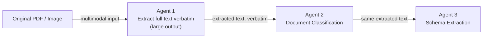
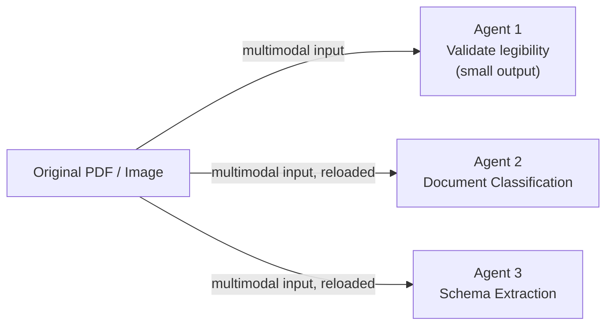

# Gemini Document-Processing Architecture Benchmark — Explainer

This document explains what the benchmark harness in this repo does, the two
architectures it compares, and how to read the results — including a cost
estimate using published Gemini 3.1 Pro Preview pricing.

## The question being answered

When a pipeline runs several agents over the same document, there are two
straightforward ways to give each agent access to the document:

1. **Extract the text once, then pass it to every downstream agent.**
2. **Give every agent the raw document and let it reprocess it independently.**

These choices can have very different cost profiles as documents get longer or
more agents are added. The harness measures the difference using the same
documents, model, and questions, changing only the architecture.

## Executive Summary

For **2,500 applications per month**, with **5 documents per application** and
about **700 text tokens per document**, the monthly total is 12,500 documents.
For this planning estimate, each document is a **5-page PDF**. Google's
document-processing guidance assigns approximately **258 input tokens per PDF
page**, so the raw PDF representation is **1,290 tokens per document**. The
700-token transcript is counted separately only when Approach A sends that
text to Agents 2 and 3.
Using the Gemini 3.1 Pro Preview prices above ($2 per 1M input tokens and $12
per 1M output tokens), the estimate is:

| Metric | Approach A (extract once) | Approach B (reprocess) | Difference |
|---|---:|---:|---:|
| Input tokens per document | 2,690 | 3,870 | B uses 1,180 more |
| Output tokens per document | 800 | 100 | A uses 700 more |
| Input-token cost per document | $0.00538 | $0.00774 | B costs $0.00236 more |
| Output-token cost per document | $0.00960 | $0.00120 | A costs $0.00840 more |
| **Total cost per document** | **$0.01498** | **$0.00894** | **B saves $0.00604** |
| **Total cost per application** | **$0.07490** | **$0.04470** | **B saves $0.03020** |
| **Total monthly cost** | **$187.25** | **$111.75** | **B saves $75.50** |
| Sequential agent latency per document | **6.84s** | **13.37s** | **A is 6.52s faster** |

### Spreadsheet-style monthly roll-up

#### Approach A — Extract once

| Input | Value |
|---|---:|
| PDF pages per document | 5 |
| Document input tokens per page | 258 |
| Raw PDF input tokens per document | 1,290 |
| Extracted text passed to Agents 2 and 3 | 700 each |
| Total input tokens per document | 2,690 |
| Number of documents per application | 5 |
| Input tokens per application | 13,450 |
| Number of applications | 2,500 |
| Monthly input tokens | 33.625M |
| Monthly input cost at $2 / 1M | $67.25 |
| Output tokens per document | 800 |
| Monthly output tokens | 10.00M |
| Monthly output cost at $12 / 1M | $120.00 |
| **Total monthly cost** | **$187.25** |

#### Approach B — Reprocess

| Input | Value |
|---|---:|
| PDF pages per document | 5 |
| Document input tokens per page | 258 |
| Raw PDF input tokens per document | 1,290 |
| Number of agents | 3 |
| Total input tokens per document | 3,870 |
| Number of documents per application | 5 |
| Input tokens per application | 29,700 |
| Number of applications | 2,500 |
| Monthly input tokens | 48.375M |
| Monthly input cost at $2 / 1M | $96.75 |
| Output tokens per document | 100 |
| Monthly output tokens | 1.25M |
| Monthly output cost at $12 / 1M | $15.00 |
| **Total monthly cost** | **$111.75** |

### Token breakdown by agent

This is the part that is easy to miss: the raw PDF input is the same for Agent
1 in both approaches. The difference is what happens afterward. Approach A
sends the extracted 700-token transcript to Agents 2 and 3, while Approach B
sends the 5-page PDF to all three agents:

| Agent | Approach A input | Approach B input | Approach A output | Approach B output |
|---|---:|---:|---:|---:|
| Agent 1: extraction / legibility | 1,290 raw PDF tokens | 1,290 raw PDF tokens | 800 transcript tokens | 100 answer tokens |
| Agent 2: classification | 700 extracted-text tokens | 1,290 raw PDF tokens | Included in 800 | Included in 100 |
| Agent 3: schema extraction | 700 extracted-text tokens | 1,290 raw PDF tokens | Included in 800 | Included in 100 |
| **Total per document** | **2,690** | **3,870** | **800** | **100** |

So Approach A uses **1,180 fewer input tokens per document**, or **30.5% less**
than Approach B under this PDF model. Approach B sends the 1,290-token raw PDF
three times, while Approach A sends it once and sends the 700-token extracted
text to each later agent.

### Pricing comparison

The token counts and architecture stay exactly the same; only the model price
changes:

| Model | Approach A monthly cost | Approach B monthly cost | B saves |
|---|---:|---:|---:|
| Gemini 2.5 Pro ($1.25 input / $10 output per 1M) | $142.03 | $72.97 | $69.06 |
| **Gemini 3.1 Pro Preview ($2 input / $12 output per 1M)** | **$187.25** | **$111.75** | **$75.50** |

Source for both model rates: [Gemini Developer API pricing — ai.google.dev](https://ai.google.dev/gemini-api/docs/pricing).
Gemini 3.1 Pro Preview's output price includes thinking tokens.

The relative difference gets smaller with Gemini 3.1 Pro Preview: B is about
**48.6% cheaper** with Gemini 2.5 Pro and about **40.3% cheaper** with Gemini
3.1 Pro Preview. The input rate rises from $1.25 to $2.00 per 1M tokens, while
the output rate rises from $10 to $12. Because Approach A has the much larger
800-token output, the output price has a strong effect on both approaches.

| Model | A's input-cost advantage over B | A's output-cost disadvantage | Net B saving per document |
|---|---:|---:|---:|
| Gemini 2.5 Pro | $0.00148 | $0.00840 | $0.00693 |
| Gemini 3.1 Pro Preview | $0.00236 | $0.00840 | $0.00604 |

With this PDF model, Approach B is estimated to cost about 40.3% less than
Approach A, even though it takes about 95.4% longer per document once
artifact-store loading is included. The main reason for the cost difference is
that, in Approach A, Agent 1 has to produce the full 700-token transcript.
Output tokens cost much more than input tokens. Approach A sends less document
data and is faster in the measured benchmark, while Approach B avoids the long
transcription but resends the original document to all three agents.

For the cost arithmetic, Approach A uses **2,690 input tokens per document**:
1,290 tokens for the raw 5-page PDF plus 700 extracted-text tokens for each of
Agents 2 and 3. It uses **800 output tokens**. Approach B sends the 1,290-token
raw PDF to all three agents, for **3,870 input tokens**, and uses **100 output
tokens**. These are the input and output totals used in the tables above.

The 700 text tokens are treated as Agent 1's transcript output and as text
input to Agents 2 and 3; they are not automatically added again to the raw
multimodal input. They would be added separately only if the same text were
also sent alongside the document image. For an exact production number, pass
the actual document and prompts to Gemini's `count_tokens()`.

The estimate also uses the sample's prompt overhead and downstream output sizes.
For an exact production number, pass the actual document and prompts to
`count_tokens()` and use the resulting input counts in the pricing formula.

The cost estimate assumes one extraction, one classification, and one schema
extraction call per document, using the sample's output sizes for the
downstream agents. The latency estimate uses the sample's average time for
one document and adds **3 seconds every time the raw document is loaded from
the artifact store**. Approach A loads each document once, adding 3 seconds;
Approach B loads each document for all three agents, adding 9 seconds. The
agents run sequentially for each document, while the five documents in one
application can be processed in parallel. So application wall-clock latency
can be close to the per-document latency when those five document jobs run
concurrently, even though total compute and API usage still scale with five
documents. The latency figures remain based on the measured benchmark plus
artifact-store loading. A production rerun with representative documents would
be the best final check.

The two cost columns use different prices: Gemini 3.1 Pro Preview charges $2 per
1M input tokens and $12 per 1M output tokens. In other words, one output token
costs six times as much as one input token. That is why Approach A's 800 output
tokens cost more than its 2,690 input tokens, while Approach B's 3,870 input
tokens remain relatively inexpensive compared with its 100 output tokens.

### How PDF tokens are counted

For a native or scanned PDF, it is better to think of the PDF page as a
document/vision input rather than as ordinary text pasted into the prompt.
Google's document-processing guidance assigns approximately **258 tokens per
PDF page**, so the five-page document in this estimate contributes:

```text
5 pages x 258 tokens = 1,290 raw PDF input tokens
```

For a scanned PDF, Gemini also uses OCR to understand the text in the page
image. Google's media-resolution guidance describes scanned-PDF processing as
`256 + OCR`; this does not mean that the OCR text should always be added as a
second, independently billable pool on top of the page representation. The
exact count depends on the document and processing configuration, so the
production value should come from `count_tokens()` and the response
`usage_metadata`.

The current spreadsheet model therefore uses 1,290 as the raw PDF input count
and treats the 700-token transcript as a separate text input only for Approach
A's Agents 2 and 3. This avoids double-counting OCR text inside the PDF input.

For image files rather than PDFs, Gemini's image tokenization depends on image
dimensions and tiling. An image at or below 384 pixels in both dimensions is
counted as 258 tokens; larger images can be split into 768x768 tiles, with
approximately 258 tokens per tile. That image rule should not be silently
substituted for the PDF rule above.

## Approach A — "Extract once"



- The original document is loaded and sent to Gemini **once**, to Agent 1.
- Agent 1 extracts all readable text verbatim. This is a large-output task
  because the later agents will use that text.
- Agent 1's raw text output is saved and reused **verbatim** — no re-extraction,
  editing, or summarizing.
- The downstream agents receive the saved text and ask focused questions,
  such as classification or field extraction. They never see the original file.
- Only Agent 1's Gemini call is multimodal (document bytes plus prompt);
  Agents 2 and 3 are text-only calls.

**Cost in simple terms**: the document-processing cost, including the large
multimodal input, is paid once per document. The main extra cost is Agent 1's
large transcription output, which then becomes reusable input for the
downstream agents.

## Approach B — "Reprocess"



- Every agent independently loads the original document and sends it to Gemini
  as multimodal input.
- Agents are independent: none relies on another agent's output, and there is
  no shared extracted-text state.
- **Agent 1 has a different job here**: it checks whether the document is
  legible and returns a small two-field JSON verdict. Agents 2 and 3 ask their
  own focused questions about the document. The prompts ask for the answers,
  not extra explanations, so the responses stay small.
- The document is loaded **three times**, once per agent. That repeated load
  time is measured in the program; see `load_document()`.

**Cost in simple terms**: every agent pays for the large multimodal input, but
each agent's output stays small. Input cost grows with the number of agents;
output cost changes much less.

## What's held constant between A and B, and what's deliberately different

To keep the comparison fair, the test keeps these things the same:

- Same documents, same Gemini model, same number of agents, same run count.
- **Agents 2 and 3 use the same `prompt`** in both approaches. Only the
  document they receive changes: extracted text in A, raw document in B.
- **Agent 1 uses different instructions on purpose.** In A it produces the
  reusable full text. In B, nothing uses its output, so it only checks
  readability. This is set by the `approach_a_prompt` field for Agent 1 in
  `agents_config.json`.
- The agents do simple tasks so the test measures latency and token cost,
  rather than the quality of a real business process.
- The two approaches run separately: A first, then B.

## What gets measured, per Gemini call

`document_name, approach, agent_name, agent_number, run_index, start_time,
end_time, latency_seconds, document_load_seconds, gemini_api_latency_seconds,
total_agent_latency_seconds, input_token_count, output_token_count,
total_token_count, model_name, success, error_message`

— written to `output/gemini_calls_<timestamp>.csv`, one row per call. A second
file, `output/document_summary_<timestamp>.csv`, rolls this up to one row per
document, approach, and run: total latency, total tokens, call count, and
failures. The final console report compares mean, P50, and P95 latency, along
with token totals and percentage differences.

## Repo layout

| File | Purpose |
|---|---|
| `gemini_architecture_benchmark.py` | The harness itself |
| `agents_config.json` | Agent names/prompts (editable, no code changes needed) |
| `dc_data/` | Sample input documents |
| `test_gemini_api.ipynb` | Minimal notebook to sanity-check API key/model before a full run |
| `output/` | Generated CSVs (gitignored) |
| `pricing_config.json` | Optional token pricing for cost estimates (see below) |

## Results so far (sample run, 2 documents, 3 agents, 1 run each)

Measured on `gemini-3.5-flash-lite` (see "A note on model access" in
`README.md` — this key doesn't currently have `gemini-2.5-pro` access, so
this run substitutes a free-tier model; the *architectural* difference in
latency/tokens still holds regardless of which model is underneath, since
both approaches use the same model in the same run):

| Metric | Approach A (extract once) | Approach B (reprocess) | B vs A |
|---|---:|---:|---:|
| Gemini calls | 6 | 6 | — |
| Avg latency (s) | 1.281 | 1.456 | +13.7% |
| P50 latency (s) | 1.128 | 1.553 | +37.7% |
| P95 latency (s) | 1.989 | 1.820 | -8.5% |
| Avg input tokens | 534.3 | 1138.7 | +113.1% |
| Avg output tokens | 94.2 | 40.3 | **-57.2%** |
| Total tokens | 3,771 | 7,074 | +87.6% |

Two distinct effects are visible here, matching the two architectures'
actual token shapes:

- **Input tokens are much higher for B** (+113.1%) — this is the direct
  cost of resending the full document to every agent instead of just once.
- **Output tokens are much *lower* for B** (-57.2%) — because B's Agent 1
  only returns a small 2-field legibility verdict instead of transcribing
  the whole document, while A's Agent 1 must produce that full
  transcription. Looking at individual calls on the same documents:
  - `document_extraction`: A outputs 168-184 tokens (full transcription) vs.
    B's 24 tokens (small JSON verdict) — the one agent whose job genuinely
    differs between approaches.
  - `document_classification`: **1 output token in both approaches** —
    identical prompt, identical minimal answer, exactly as it should be.
  - `schema_extraction`: ~94-110 tokens in both approaches — also
    identical, since extracting several real field values inherently takes
    more than one token regardless of architecture.

Input tokens dominate the total either way, so B still costs more overall,
but by a much smaller, more honest margin than when Agent 1's prompt was
accidentally shared across both approaches.

### Step-by-step walkthrough: one document through both approaches

Full per-agent trace for `dc1.png`, straight from that run's
`gemini_calls_20260916_233702.csv` (model: `gemini-3.5-flash-lite`; cost
column uses the Gemini 2.5 Pro rates from the section below: $1.25/1M
input, $10/1M output).

**Approach A — extract once**

| Step | Agent | What it does | Its input | Input tokens | Latency | Output tokens | Cost |
|---|---|---|---|---:|---:|---:|---:|
| 1 | `document_extraction` | Calls Gemini with the original image, extracts all text verbatim | the raw `dc1.png` file | 1,132 | 2.104s | 184 | $0.003255 |
| 2 | `document_classification` | Calls Gemini with a classification question | Agent 1's extracted text, verbatim | 234 | 0.727s | 1 | $0.000303 |
| 3 | `schema_extraction` | Calls Gemini asking for 6 specific fields as JSON | Agent 1's extracted text, verbatim | 247 | 1.178s | 110 | $0.001409 |
| **Total** | | | | **1,613** | **4.009s** | **295** | **$0.004967** |

Note the data flow: Agents 2 and 3 both receive **Agent 1's output directly**
— they don't chain off each other. Agent 3 doesn't see Agent 2's
classification result; both just independently ask their own question of
the same stored text. Only Agent 1 ever touches the original image.

**Approach B — reprocess**

| Step | Agent | What it does | Its input | Input tokens | Latency | Output tokens | Cost |
|---|---|---|---|---:|---:|---:|---:|
| 1 | `document_extraction` | Calls Gemini with the original image, checks legibility only | the raw `dc1.png` file (reloaded from disk) | 1,149 | 1.750s | 24 | $0.001676 |
| 2 | `document_classification` | Calls Gemini with a classification question | the raw `dc1.png` file (reloaded from disk again) | 1,118 | 1.610s | 1 | $0.001408 |
| 3 | `schema_extraction` | Calls Gemini asking for 6 specific fields as JSON | the raw `dc1.png` file (reloaded from disk again) | 1,131 | 1.843s | 98 | $0.002394 |
| **Total** | | | | **3,398** | **5.205s** | **123** | **$0.005477** |

Here every agent independently reloads and resends the same file — that's
the entire +1,785 input-token, +$0.00051, +1.196s difference between the
two totals on this one document. (Latency totals are the sum of each
agent's own call; if the three agents ran concurrently instead of
sequentially, wall-clock time would be closer to the single slowest agent
rather than the sum — but this harness runs agents sequentially by design,
matching how the goal specifies both architectures should operate.)

### Input tokens: raw document vs. extracted text, per call

This is the direct answer to "how much cheaper is text-only input than
resending the document": every per-agent input token count from that same
run, `gemini_calls_20260916_233702.csv`, agent by agent:

| Document | Agent | Approach A input tokens | Approach B input tokens |
|---|---|---:|---:|
| dc1.png | document_extraction (multimodal in both) | 1,132 | 1,149 |
| dc1.png | document_classification | **234** (text-only) | 1,118 (multimodal, reloaded) |
| dc1.png | schema_extraction | **247** (text-only) | 1,131 (multimodal, reloaded) |
| dc2.png | document_extraction (multimodal in both) | 1,144 | 1,161 |
| dc2.png | document_classification | **218** (text-only) | 1,130 (multimodal, reloaded) |
| dc2.png | schema_extraction | **231** (text-only) | 1,143 (multimodal, reloaded) |

Agent 1 is multimodal in both approaches (~1,130-1,160 input tokens either
way — the two prompts are different lengths, hence the small A/B gap on
that row alone). The comparison that matters is everything *after* Agent 1:

| | Avg input tokens/call | 
|---|---:|
| Raw document, resent (Approach B, agents 2 & 3) | 1,130.5 |
| Extracted text only (Approach A, agents 2 & 3) | 232.5 |

**Extracted-text input is 79.7% smaller — about 4.9x fewer tokens per
downstream call** than resending the raw document. That gap is the entire
mechanism behind Approach A's lower cost: it only pays the ~1,130-token
"send the document" price once (Agent 1), while Approach B pays it again,
in full, for every single agent.

Rolled up to per-document totals (sum of input tokens across all 3 agents):

| Document | Approach A total input | Approach B total input | B vs A |
|---|---:|---:|---:|
| dc1.png | 1,613 | 3,398 | +110.7% |
| dc2.png | 1,593 | 3,434 | +115.6% |

With 3 agents, Approach B's downstream agents (2 of the 3) each pay the
full ~1,130-token document price instead of the ~230-token text price —
that's where essentially all of the +113% average-input-token gap reported
above comes from.

## Cost projection using Gemini 2.5 Pro pricing

The harness doesn't assume any token price by default (see `README.md`
"Pricing"), but since the goal specifically targets `gemini-2.5-pro`, here's
what the measured token counts above would cost at Google's **published**
2.5 Pro rates (paid tier, prompts ≤200k tokens, current as of Sep 2026):

- **Input**: $1.25 per 1M tokens
- **Output**: $10.00 per 1M tokens

Source: [Gemini Developer API pricing — ai.google.dev](https://ai.google.dev/gemini-api/docs/pricing)

Applying those rates to the actual token totals from the sample run above:

| | Approach A | Approach B | Difference |
|---|---:|---:|---:|
| Total input tokens | 3,206 | 6,832 | +113.1% |
| Total output tokens | 565 | 242 | -57.2% |
| **Cost for these 2 documents** | **$0.009658** | **$0.010960** | **+13.5%** |
| Extrapolated to 1,000 documents | **≈ $4.83** | **≈ $5.48** | **+$0.65** |

Caveat: these token *counts* came from `gemini-3.5-flash-lite`'s tokenizer,
not `gemini-2.5-pro`'s — actual 2.5 Pro token counts for the same documents
would likely differ somewhat (different tokenizer/vision encoding), so
treat this as an order-of-magnitude illustration, not an exact quote. The
qualitative shape — B's input cost dominates and pushes its total above A,
even though B's output cost is actually lower — follows directly from each
architecture's structure and would hold on 2.5 Pro too.

To get a live cost estimate on your own runs at whatever rates you choose,
copy `pricing_config.example.json` to `pricing_config.json` (already done
here, pre-filled with the 2.5 Pro rates above) and pass
`--pricing-config pricing_config.json` — the harness adds an
"Est. cost (USD)" row to its final report automatically.

## Takeaway

On the small sample run, Approach A (extract once) was cheaper overall and
had lower P50/mean latency, but the reason is more specific than "B repeats
more work": B's *input* cost scales with agent count (every agent re-pays for
the full document), while B's *output* cost is much lower than A's, since only
A's Agent 1 has to transcribe anything. With the spreadsheet's 700-token,
1,290-raw-PDF-token planning case, the projection above makes B cheaper, while
A remains faster in the measured sequential pattern. Approach
B's structural advantage is that agents are fully independent — no
extraction-quality bottleneck where one bad Agent-1 call breaks everyone
downstream. The right choice depends on document size, output-token pricing,
latency requirements, and whether that independence is worth the repeated
multimodal input.
